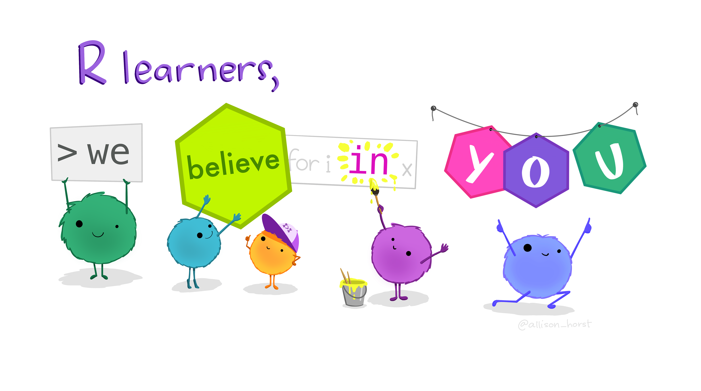
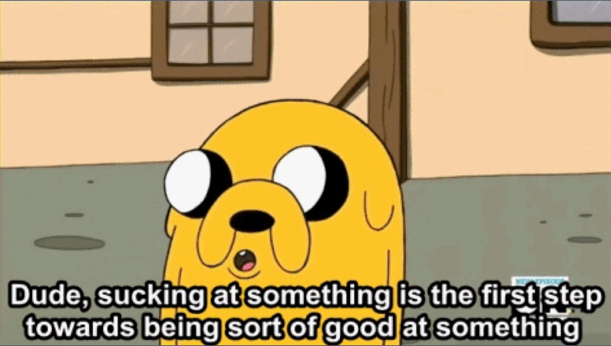

```{r setup, include=FALSE}
knitr::opts_chunk$set(warning = FALSE, message = FALSE, 
                      fig.retina = 3, fig.align = "center")
```

```{r packages-data, include=FALSE}
library(tidyverse)
```

```{r xaringanExtra, echo=FALSE}
xaringanExtra::use_xaringan_extra(c("tile_view", "share_again"))
```

class: center middle main-title section-title-4

# Data Manipulation in R

.class-info[

**Lesson 1**

.light[API 209: Advanced Quantative Methods<br>
TF: Rony Rodriguez-Ramirez<br>
Summer 2024]

]

---

name: outline
class: title title-inv-5

# Plan for today

1. Getting to know each other
2. The layout of this summer camp (just the R part)
3. Why R, RStudio, Positron?
4. Data manipulation in R

---

layout: false
name: knowing-each-other
class: center middle section-title section-title-crimson

# Getting to know each other

---

layout: true
class: title title-crimson

---

# Who am I?

.box-inv-crimson.medium[Rony Rodriguez-Ramirez (G2)]

--

.box-inv-crimson.medium[Ed Policy (Economics of Education) Program]

--

.box-inv-crimson.medium[Previous exp: The World Bank]

--

.box-inv-crimson.medium[Like coding!]

---

# My role (?)

**What should you expect from me?**

.small[
1. My job if that you feel confident in R.
2. I should be there if you have any questions.
3. Reply to your emails or slack messages.
]

--

**At the end of this summer camp?**

.small[
1. You should be ready for the semester.
2. Know enough about R.
3. Know how to craft questions and where to look for answers.
4. Be happy (?)
]

---

# Course assistants for Math Camp

.pull-left-3[
**Hussaini Shan-e-Abbas**
]

.pull-middle-3[
**Ayush Shukla**
]

.pull-right-3[
**Sara Wong Becerra**
.center[
  <figure>
  
  </figure>
]
]

---

layout: false
name: layout-summer-camp
class: center middle section-title section-title-crimson

# The layout

---

layout: true
class: title title-crimson 

---

# The layout

**What are we going during math camp (R Part)?**

.small[
8 sessions over the next weeks:

1. 4 Lessons (2 hours)
  - I will discuss about coding, strategies, and implementation
2. 4 Labs (1.5 hours)
  - It will be a hands-on session. I will provide you with exercises and we will solve them together.
3. Optional: Office hours
]

---

# The layout

There is a website for this summer camp:

.box-inv-crimson.medium[[website](https://harvard-api209.github.io/api209-math-camp/)]

It is not up-to-date; but every week, you will have the materials for that respective week, i.e., you should have already your lab for tomorrow.

---

# Coding

Coding is a Skill

.box-inv-crimson.medium[**It is most fun to practice a skill with people you know.**]

---

# Discussion Activity: Archetypes

.pull-left[

```{r plot-archetype, echo=FALSE, fig.dim=c(4.8, 3.75), out.width="100%"}

library(ggplot2)

# Example data for student archetypes
student_data <- data.frame(
  name = c("Alice", "Bob", "Charlie", "Dana", "Ethan"),
  excitement = c(4, 2, 3, 5, 1),  # scale of 1-5
  experience = c(2, 4, 2, 5, 1)   # scale of 1-5
)

crimson <- "#A51C30"

# Create the scatter plot
student_data |> 
  ggplot(aes(x = experience, y = excitement, label = name)) +
  geom_vline(xintercept = 3, linetype = "dashed", color = crimson) +
  geom_hline(yintercept = 3, linetype = "dashed", color = crimson) +
  geom_point(size = 5, pch = 21, fill = crimson, color = "black") +
  geom_text(size = 5, vjust = -1, hjust = "inward", family = "Fira Sans Condensed Light") +
  labs(
    title = "Student Archetypes:", 
    subtitle = "Excitement vs Experience",
    x = "Experience with R (1-5)",
    y = "Excitement about R (1-5)",
    caption = "Credit: @Dom | Former TF."
  ) +
  scale_x_continuous(limits = c(1,5), expand = expansion(mult = 0.1)) +
  scale_y_continuous(limits = c(1,5), expand = expansion(mult = 0.1)) +
  coord_cartesian(clip = "off") + 
  theme_minimal(base_family = "Fira Sans Condensed Light") +
  theme(
    panel.grid = element_blank(),
    axis.line = element_line(color = "black"),
    axis.title = element_text(family = "Fira Sans Condensed", face = "bold"),
    axis.title.y = element_text(angle = 90, vjust = 0.5),
    plot.title = element_text(family = "Fira Sans Condensed", face = "bold", size = rel(1.7)),
    plot.subtitle = element_text(size = rel(1.2), color = "grey50"),
    plot.caption = element_text(color = "grey50")
  )

```
]

.pull-right[

.small[

- **Intros**: Name, where you’re from, favorite midday snack or superhero.
- **Experience**: With statistics, programming, and/or R? (Yes/No)
- **Which quadrant describes you?**
]

]

---

# Classroom Norms

**Class is a collective enterprise!**

- Allow everyone the chance to speak.
- Be mindful of thoughts and actions.
- Understand differing levels of knowledge and experience.
- Help others in your group!
- Don’t be afraid to ask questions!
- Respect others’ opinions and suggestions.
- Try questions on your own first, then come together.
- Take breaks and have fun!

---

layout: false
name: why-r
class: center middle section-title section-title-crimson

# Why R, RStudio, Positron?

---

layout: true
class: title title-crimson 

---

# Why R, RStudio, and Positron?

**Why R?**

- Open-source and free.
- Extensive ecosystem for statistical analysis.
- Wide range of packages for data manipulation and visualization.
- Active and supportive community.

---

# RStudio and Positron: The IDEs for R

.small[

**Why RStudio?**
- Integrated development environment (IDE) that simplifies coding in R.
- Built-in tools for code development, debugging, and collaboration.
- Seamless integration with RMarkdown for dynamic report generation.
- Powerful tools for data visualization and manipulation.

**Why Positron?**
- New, modern IDE designed to enhance the R programming experience.
- Sleeker interface with enhanced performance and features.
- Supports the latest R packages and workflows.
- Focuses on integrating modern development tools and practices.

]

---

# Which IDE Should You Use?

**RStudio vs. Positron**

- **RStudio** is well-established with a large user base and extensive support.
- **Positron** offers cutting-edge features for those looking to adopt the latest tools.
- Consider trying both to see which fits your workflow best.
- During the pre-summer assignment, we used **Posit Cloud**.
  - For those who haven't installed, either RStudio not Positron in your computer, there is a Posit Cloud Project [here]()

---

# The tidyverse

.center[
<figure>
  
</figure>
]

---

layout: false
name: data-manipulation
class: center middle section-title section-title-crimson

# Data manipulation

---

layout: true
class: title title-crimson 

---

# Advanced Data Manipulation

**Mastering Data Manipulation in R**

- **Advanced Filtering and Selection**: 
    - Use of conditional filtering and dynamic column selection.
- **Complex Mutate Operations**:
    - Creating conditional columns, using lag and lead.
- **Data Reshaping**:
    - Pivoting data, advanced grouping.
- **Efficient Data Handling**:
    - Joining datasets, parallel processing.

---

# Recap: The Tidyverse

**The tidyverse is a collection of R packages designed for data science.**  
They share an underlying design philosophy, grammar, and data structures.

.small[
**Core Packages:**
- `ggplot2` - Data visualization
- `dplyr` - Data manipulation
- `tidyr` - Data tidying
- `readr` - Data import
- `purrr` - Functional programming
- `tibble` - Modern data frames
- `stringr` - String manipulation
- `forcats` - Categorical data
]

---

# dplyr: Key Functions

**Commonly Used Functions:**
- `filter()` - Subset rows based on conditions
- `select()` - Choose columns by names
- `mutate()` - Create new columns or modify existing ones
- `arrange()` - Reorder rows
- `summarize()` - Aggregate data
- `group_by()` - Group data for summary operations

---

# dplyr: Example

.left-code[
```{r filtered-data, eval = FALSE}
# Example of dplyr in action
library(dplyr)

# Filter and select
filtered_data <- starwars |> 
  filter(height > 180) |> 
  select(name, height, hair_color)

filtered_data
```
]

.pull-right[
```{r filtered-data, echo=FALSE}
```
]

---

# dplyr: Example

.left-code[
```{r mutated-data, eval = FALSE}
# Mutate
starwars |>
  mutate(
    tatooine = ifelse(  #<<
      homeworld == "Tatooine",  #<<
      "Tatooine",  #<<
      "Others"  #<<
    ) #<<
  ) |> 
  group_by(tatooine) |> 
  summarize(
    mean = mean(height)
  )
```
]

.pull-right[
```{r mutated-data, echo=FALSE}
```
]

---

# Are we good here?

.small[
  As of now, you should have the tools to understand the last code. More resources are available in our website. Now, it's time to make some mistakes! 
]

.center[
<figure>
  
  <figcaption>Artwork by @allison_horst</figcaption>
</figure>
]


---
layout: false
name: takeaways
class: center middle section-title section-title-crimson

# Takeaways

---

layout: true
class: title title-crimson 

---

# Sucking (Slide from Prof. Andrew Heiss)

.center[
.box-inv-crimson.medium[“There is no way of knowing nothing about a subject to knowing something about a subject without going through a period of much frustration and suckiness.”]

.box-inv-crimson.medium[**“Push through. You’ll suck less.”**]

.box-inv-crimson.tiny[Hadley Wickham, author of {ggplot2}]
]

???

[Source for quote](https://twitter.com/Akbaritabar/status/1022057084802748416)

---

# Sucking

&nbsp;

.center[
<figure>
  
</figure>
]

---

# Sucking

&nbsp;

.center[
<figure>
  
  <figcaption>Artwork by @allison_horst</figcaption>  
</figure>
]
