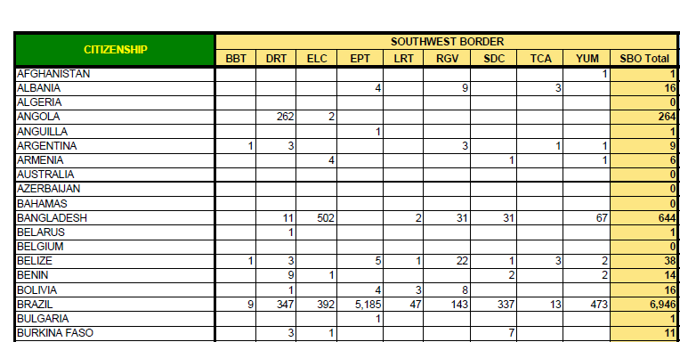
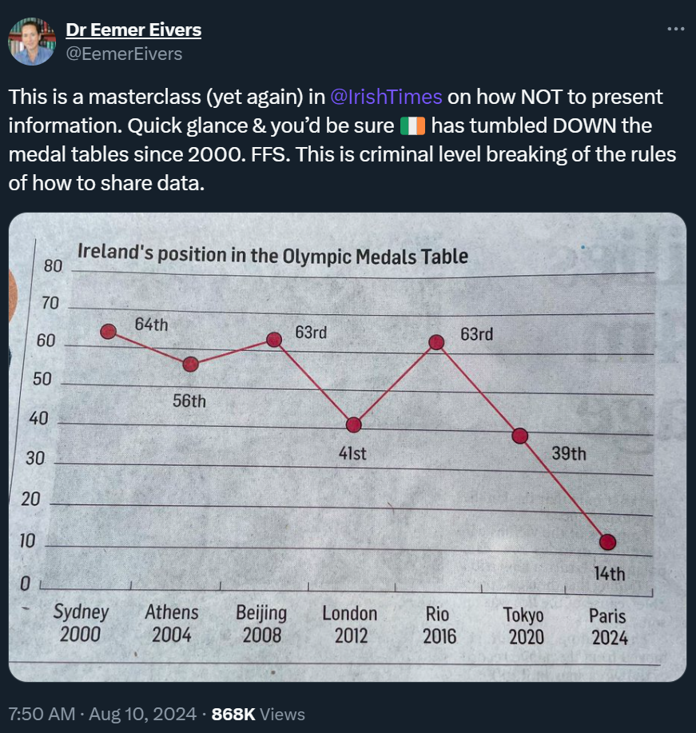
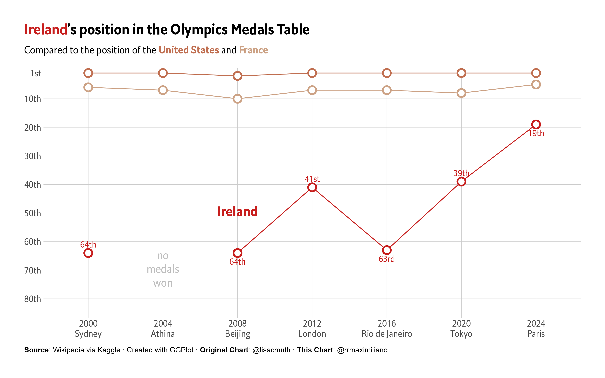
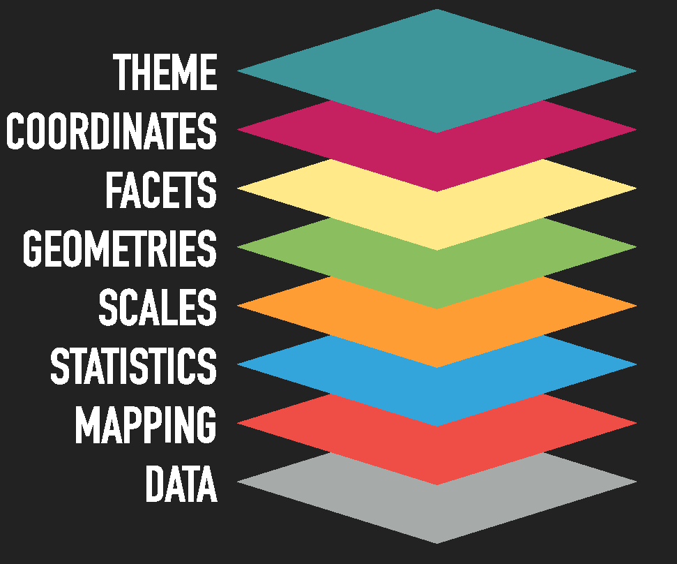
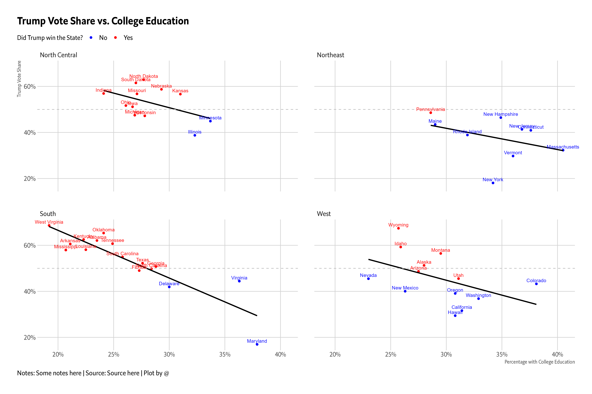

```{r setup, include=FALSE}
knitr::opts_chunk$set(warning = FALSE, message = FALSE, 
                      fig.retina = 3, fig.align = "center")

if(!require(flair)) devtools::install_github("r-for-educators/flair")
library(flair)
library(xaringanExtra)
library(tidyverse)
library(gapminder)
xaringanExtra::use_panelset()
# xaringanExtra::use_webcam()
xaringanExtra::use_clipboard()
```

```{r xaringanExtra, echo=FALSE}
xaringanExtra::use_xaringan_extra(c("tile_view", "share_again"))
```

class: center middle main-title section-title-4

# Tidy Data and Visualization

.class-info[

**Lesson 2**

.light[API 209: Advanced Quantative Methods<br>
TF: Rony Rodriguez-Ramirez<br>
Summer 2024]

]

---

layout: false
name: tidy-data
class: center middle section-title section-title-crimson

# Recap and Tidy Data

---

layout: true
class: title title-crimson

---

# Wrangling your data {Recap}


* You are ***highly encouraged*** to read through [Hadley Wickham's chapter](https://r4ds.had.co.nz/transform.html). It's clear and concise.

* Also check out this great "cheatsheet" [here](https://github.com/rstudio/cheatsheets/blob/master/data-transformation.pdf).

* The package is organized around a set of **verbs**, i.e. *actions* to be taken.

* All *verbs* work as follows:

$$\text{verb}(\underbrace{\text{data.frame}}_{\text{1st argument}}, \underbrace{\text{what to do}}_\text{2nd argument})$$

* Alternatively you can (should) use the `pipe` operator `%>%`:

$$\underbrace{\text{data.frame}}_{\text{1st argument}} \underbrace{\text{ %>% }}_{\text{"pipe" operator}} \text{verb}(\underbrace{\text{what to do}}_\text{2nd argument})$$


---

# Tidy data


- In most cases, your datasets won't be `tidy`. 

> **Tidy data**: A dataset is said to be tidy if it satisfies the following conditions: 

```{r, echo = FALSE, out.width="60%"}
knitr::include_graphics("https://cdn.myportfolio.com/45214904-6a61-4e23-98d6-b140f8654a40/85520b8f-4629-4763-8a2a-9ceff27458bf_rw_1920.jpg?h=21007b20ac00cf37318dca645c215453")
```

---

# Untidy data is pretty common

.center[



]

However, storing data in wide form is easier to display in a printed table. 

---
layout: false
class: center middle

.huge[
  .box-crimson[Tidy] data<br>is data in<br>.box-crimson[long] format
]

---

layout: false
name: beautiful-visualizations
class: center middle section-title section-title-crimson

# Beautiful visualizations

---

layout: false
class: center middle

```{r, echo = FALSE, out.width="70%"}
knitr::include_graphics("img/02/01_dubois_georgia_negro_budget.jpg")
```

---

layout: true
class: title title-crimson

---

# What makes a great visualization?

.box-inv-6.medium[Truthful]

.box-inv-6.medium[Functional]

.box-inv-6.medium[Beautiful]

.box-inv-6.medium[Insightful]

.box-inv-6.medium[Enlightening]

.box-6.tiny[Alberto Cairo, *The Truthful Art*]

???

Alberto Cairo, *The Truthful Art*:

> 1. It is truthful, as it’s based on thorough and honest research.
> 
> 2. It is functional, as it constitutes an accurate depiction of the data, and it’s built in a way that lets people do meaningful operations based on it (seeing change in time).
> 
> 3. It is beautiful, in the sense of being attractive, intriguing, and even aesthetically pleasing for its intended audience—scientists, in the first place, but the general public, too.
> 
> 4. It is insightful, as it reveals evidence that we would have a hard time seeing otherwise.
> 
> 5. It is enlightening because if we grasp and accept the evidence it depicts, it will change our minds for the better.

---

# How do we express visuals in words?

- **Data** to be visualized

- **.hlb[Geom]etric objects** that appear on the plot

- **.hlb[Aes]thetic mappings** from data to visual component

- **.hlb[Stat]istics** transform data on the way to visualization

- **.hlb[Coord]inates** organize location of geometric objects

- **.hlb[Scale]s** define the range of values for aesthetics

- **.hlb[Facet]s** group into subplots


---

# What makes a great visualization?

.box-inv-6.medium[Good aesthetics]


.box-inv-6.medium[No substantive issues]


.box-inv-6.medium[No perceptual issues]


.box-inv-6.medium[Honesty + good judgment]

.box-6.tiny[Kieran Healy, *Data Visualization: A Practical Introduction*]

---

# You see bad plots everywhere: What's wrong?

.center[
<figure>
  
</figure>
]

???

- Aesthetic issues
- Substantive issues
- Perceptual issues
- Honesty + judgment issues

---

# Is this right?

.center[
<figure>
  
</figure>
]

---

layout: false
name: ggplot
class: center middle section-title section-title-crimson

# Entering ggplot

---

layout: true
class: title title-crimson

---

# ggplot

.pull-left[
For this session, you’ll use the ggplot2 package from the tidyverse meta-package.

- So, you can just load the `tidyverse` package when using ggplot.
]

.pull-right[
1. Consistency with the [**Grammar of Graphics**](https://www.springer.com/gp/book/9780387245447)
  * This book is the foundation of several data viz applications: 
  
  `ggplot2, polaris-tableau, vega-lite`
2. Flexibility
3. Layering and theme customization
4. Community

It is a powerful and easy to use tool (once you understand its logic) that produces complex and multifaceted plots.
]


---

# ggplot2: basic structure (template)

The basic ggplot structure is:


```
ggplot(data = DATA) +
  GEOM_FUNCTION(mapping = aes(AESTHETIC MAPPINGS))
```

--

.center[Mapping data to aesthetics]

.box-7[Think about colors, sizes, x and y references]

.center[We are going to learn how we connect our data to the components of a ggplot.] 

--

.center[I usually code like this:]

```
DATA |> 
  ggplot(aes(AESTHETIC MAPPINGS)) +
  GEOM_FUNCTION()
```

---

# Mapping

<center>
Mappings do not directly specify the particular, e.g., colors, shapes, or line styles that will appear on the plot. Rather, they establish which variables in the data will be represented by which visible elements on the plot.
</center>

---

# ggplot2: full structure

.pull-left[
```
ggplot(data = <DATA>) +
  <GEOM_FUNCTION>(
     mapping = aes(<MAPPINGS>),
     stat = <STAT>,
     position = <POSITION>
  ) +z
  <COORDINATE_FUNCTION> +
  <FACET_FUNCTION> +
  <SCALE_FUNTION> +
  <THEME_FUNCTION>

```
]

.pull-right[

.small[
1. `Data`: The data that you want to visualize
2. `Layers`: geom\_ and stat\_ → The geometric shapes and statistical summaries representing the data
3. `Aesthetics`: aes() → Aesthetic mappings of the geometric and statistical objects
4. `Scales`: scale_ → Maps between the data and the aesthetic dimensions
5. `Coordinate system`: coord_ → Maps data into the plane of the data rectangle
6. `Facets`: facet_ → The arrangement of the data into a grid of plots
7. `Visual themes`: theme() and theme_ → The overall visual defaults of a plot
]

]

---

# ggplot2: decomposition

.pull-left[

**There are multiple ways to structure plots with ggplot**

For this presentation, I will stick to Thomas Lin Pedersen's decomposition who is one of most prominent developers of the ggplot and gganimate package.<br><br>These components can be seen as layers, this is why we use the `+` sign in our ggplot syntax.

]

.pull-right[


]

---

# Exploratory Analysis

The most common `geoms` are:


* `geom_bar()`, `geom_col()`: bar charts.
* `geom_boxplot()`: box and whiskers plots.
* `geom_density()`: density estimates.
* `geom_jitter()`: jittered points.
* `geom_line()`: line plots.
* `geom_point()`: scatter plots.


> If you want to know more about layers, you can refer to [this](https://ggplot2.tidyverse.org/reference/).

---

# Step by step from Garrick Aden-Buie's gentle guide

Using the `gapminder` package, let's start with `lifeExp` vs `gdpPercap`

```{r summary-gapminder, echo=FALSE, comment=""}
glimpse(gapminder)
```

---
class: fullscreen
layout: true
---

.left-code[
```{r gapminder-le-gdp-0, fig.show="hide"}
ggplot(gapminder) 
```
]

.right-plot[
`)
]

The Canvas

---

.left-code[
```{r gapminder-le-gdp-0a, fig.show="hide"}
ggplot(gapminder) +
  aes(x = gdpPercap)
```
]

.right-plot[
`)
]

The Canvas

---

.left-code[
```{r gapminder-le-gdp-1, fig.show="hide"}
ggplot(gapminder) +
  aes(x = gdpPercap,
      y = lifeExp)
```
]

.right-plot[
`)
]

--

Add points...

---

.left-code[
```{r gapminder-le-gdp-2, fig.show="hide"}
ggplot(gapminder) +
  aes(x = gdpPercap,
      y = lifeExp) +
  geom_point() #<<
```
]

.right-plot[
`)
]

--

How can I tell countries apart?

---

.left-code[
```{r gapminder-le-gdp-3, fig.show="hide"}
ggplot(gapminder) +
  aes(x = gdpPercap,
      y = lifeExp,
      color = continent) + #<<
  geom_point()
```
]

.right-plot[
`)
]

--

GDP is squished together on the left

---

.left-code[
```{r gapminder-le-gdp-4, fig.show="hide"}
ggplot(gapminder) +
  aes(x = gdpPercap,
      y = lifeExp,
      color = continent) +
  geom_point() +
  scale_x_log10() #<<
```
]

.right-plot[
`)
]

--

Still lots of overlap in the countries...

---

.left-code[
```{r gapminder-le-gdp-5, fig.show="hide"}
ggplot(gapminder) +
  aes(x = gdpPercap,
      y = lifeExp,
      color = continent) +
  geom_point() +
  scale_x_log10() +
  facet_wrap(~ continent) + #<<
  guides(color = FALSE)     #<<
```

No need for color legend thanks to facet titles
]

.right-plot[
`)
]

--

Lots of overplotting due to point size

---

.left-code[
```{r gapminder-le-gdp-6, fig.show="hide"}
ggplot(gapminder) +
  aes(x = gdpPercap,
      y = lifeExp,
      color = continent) +
  geom_point(size = 0.25) + #<<
  scale_x_log10() +
  facet_wrap(~ continent) +
  guides(color = FALSE)
```
]

.right-plot[
`)
]

--

Is there a trend?

---

.left-code[
```{r gapminder-le-gdp-7, fig.show="hide"}
ggplot(gapminder) +
  aes(x = gdpPercap,
      y = lifeExp,
      color = continent) +
  geom_line() + #<<
  geom_point(size = 0.25) +
  scale_x_log10() +
  facet_wrap(~ continent) +
  guides(color = FALSE)
```
]

.right-plot[
`)
]

--

Okay, that line just connected all of the points sequentially...

---

.left-code[
```{r gapminder-le-gdp-8, fig.show="hide"}
ggplot(gapminder) +
  aes(x = gdpPercap,
      y = lifeExp,
      color = continent) +
  geom_line(
    aes(group = country) #<<
  ) +
  geom_point(size = 0.25) +
  scale_x_log10() +
  facet_wrap(~ continent) +
  guides(color = FALSE)
```

.font200.center[&#x1F914;]
]

.right-plot[
`)
]

--

&#x1F4A1; We need time on x-axis!

---

.left-code[
```{r gapminder-gdp-year-1, fig.show="hide"}
ggplot(gapminder) +
  aes(x = year, #<<
      y = gdpPercap, #<<
      color = continent) +
  geom_line(
    aes(group = country)
  ) +
  geom_point(size = 0.25) +
  scale_y_log10() + #<<
  facet_wrap(~ continent) +
  guides(color = FALSE)
```
]

.right-plot[
`)
]

---

layout: true
class: title title-crimson

---

# Time to code

.center[
<iframe src="https://giphy.com/embed/2IudUHdI075HL02Pkk" width="480" height="360" style="" frameBorder="0" class="giphy-embed" allowFullScreen></iframe><p><a href="https://giphy.com/gifs/pudgypenguins-data-code-coding-2IudUHdI075HL02Pkk">via GIPHY</a></p>
]


---

# Our goal


```{r, echo = FALSE, out.width="75%"}

```
